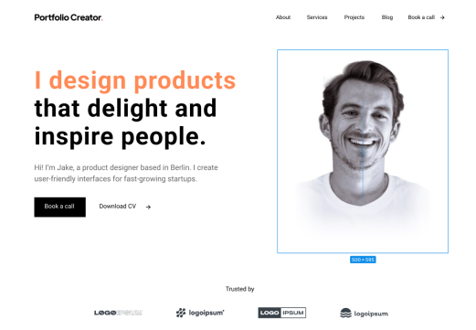

# Portfolio Creator

Одностраничный сайт-портфолио продуктового дизайнера. Лендинг с блоками Hero, Trusted by, Services, Projects, Latest Blogs, That's me!, Testimonials, FAQ и футером. Навигация по якорным ссылкам, адаптивная вёрстка под планшет и мобильные устройства.



## 📋 О проекте

Учебное задание по фронтенд-разработке. Задача — сверстать макет из Figma: <a href="https://www.figma.com/design/DQ6F2KLrUiA3WjWL5OZ9FO/Portfolio-Creator--Copy-" target="_blank">Portfolio Creator</a>.

**Цель проекта:** отработать навыки вёрстки и работы с React — сборка компонентов, работа с состоянием (аккордеон, слайдеры, бургер-меню), адаптивная сетка, hover-эффекты и плавный скролл по якорям.

## 🛠 Стек технологий

- **React 18** — библиотека для построения интерфейсов
- **Vite** — сборщик и dev-сервер (быстрый запуск, HMR)
- **CSS** — обычные CSS-файлы рядом с компонентами, без препроцессоров
- **Google Fonts** — шрифт Inter

## 🚀 Как запустить

Понадобится Node.js версии 18 или выше.

```bash
# 1. Установить зависимости
npm install

# 2. Запустить dev-сервер
npm run dev

# 3. Открыть в браузере
# http://localhost:5173
